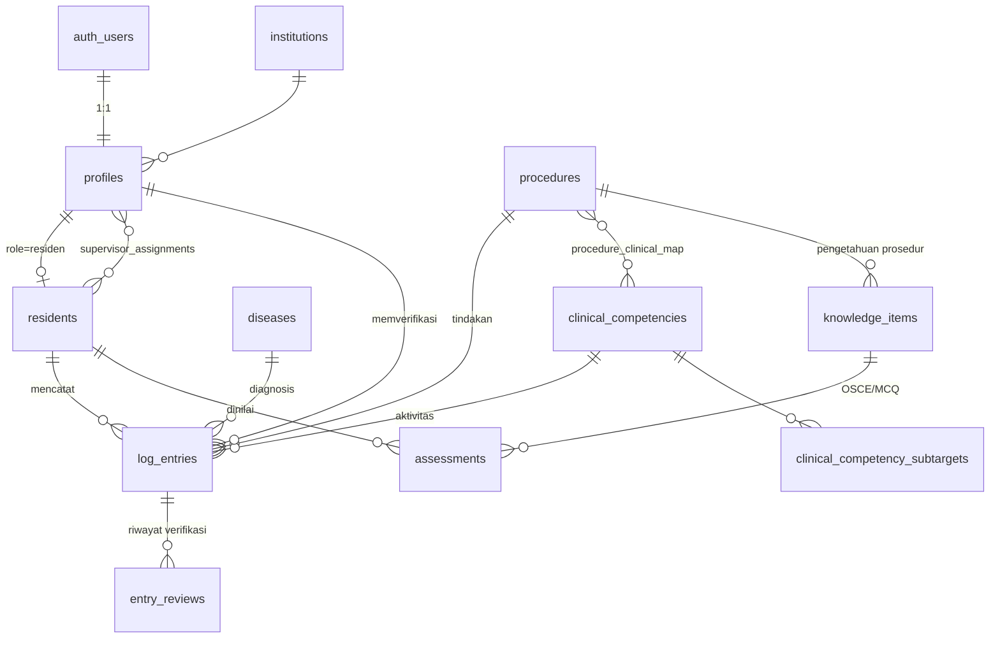

# Skema Database — Logbook Onkologi Ginekologi

Database: **PostgreSQL (Supabase)**. Migrasi di `supabase/migrations/`, data seed di `supabase/seed.sql` (di-generate dari `data/*.json`).

## Diagram relasi (ERD)

## Kelompok tabel

### 1. Referensi (seed, read-only bagi residen)
| Tabel | Isi | Sumber |
|---|---|---|
| `diseases` | 27 spektrum penyakit + ICD | Tabel 10 |
| `clinical_competencies` | 9 kompetensi penatalaksanaan + `target_min` | Tabel 18 |
| `clinical_competency_subtargets` | sub-target (MDT ≥20, breaking bad news ≥10) | Tabel 18 |
| `procedures` | 57 prosedur + `target_min` + `peran_dihitung` | Tabel 24 |
| `knowledge_items` | 65 butir pengetahuan (ambang OSCE/MCQ) | Tabel 30 & 36 |

### 2. Pengguna
- `profiles` — 1:1 dengan `auth.users`, kolom `role` (residen/supervisor/kps/penguji/admin).
- `residents` — data peserta (angkatan, tanggal mulai/target lulus, semester).
- `supervisor_assignments` — relasi banyak-ke-banyak residen↔supervisor (satu ditandai `utama`).
- `institutions` — opsional, multi-pusat pendidikan.

### 3. Aktivitas & verifikasi
- `log_entries` — **inti**. Satu aktivitas (prosedur / penatalaksanaan / kasus). Memuat: tautan kompetensi, data pasien anonim (`patient_code`, `patient_age`, `figo_stage`), `surgical_role`, `supervision_level` (EPA), bukti, dan alur status (`draft → diajukan → diverifikasi/revisi/ditolak`).
- `entry_reviews` — jejak audit setiap perubahan status (siapa, kapan, dari→ke).
- `procedure_clinical_map` — **aturan auto-agregasi**: satu prosedur juga menyumbang ke kompetensi penatalaksanaan tertentu.
- `assessments` — nilai OSCE/MCQ (persen otomatis dihitung).

## Mesin auto-agregasi (views)

Hanya entri **`diverifikasi`** yang dihitung. Residen tak pernah menghitung manual.

| View | Fungsi |
|---|---|
| `v_procedure_progress` | per residen × prosedur: jumlah terverifikasi vs `target_min`, persen, tercapai. Hanya peran dalam `peran_dihitung` yang dihitung. |
| `v_clinical_progress` | per residen × kompetensi: gabungan entri langsung **+** kontribusi prosedur via `procedure_clinical_map`. |
| `v_knowledge_progress` | per residen × butir: nilai OSCE & MCQ terbaik, lulus bila ≥ ambang. |
| `v_disease_coverage` | per residen × penyakit: sudah pernah ditangani atau belum. |
| `v_resident_summary` | rekap kelulusan total per residen (untuk dashboard KPS). |

## Keamanan (RLS — 31 policy)

| Peran | Hak akses |
|---|---|
| **Residen** | CRUD entri **milik sendiri** (ubah hanya saat `draft`/`revisi`); baca progress sendiri. |
| **Supervisor** | Baca + verifikasi entri **residen bimbingannya** (via `supervisor_assignments`). |
| **KPS/Admin** | Baca semua; kelola data referensi & pengguna. |
| **Penguji** | Kelola `assessments` (OSCE/MCQ). |

Tabel referensi: dibaca semua pengguna login, ditulis hanya KPS/Admin. View memakai `security_invoker` sehingga RLS tabel dasar tetap berlaku.

## Catatan untuk tahap berikutnya
1. `procedure_clinical_map` masih **kosong** — perlu masukan klinis Anda (prosedur mana menyumbang ke penatalaksanaan mana). Ini bahasan "aturan auto-agregasi".
2. `peran_dihitung` default `{operator_utama, ko_operator}` untuk semua prosedur — perlu disesuaikan per prosedur (mis. yang wajib operator utama saja).
3. Proyeksi "on-track" memakai `tanggal_target_lulus` — logika di aplikasi.
