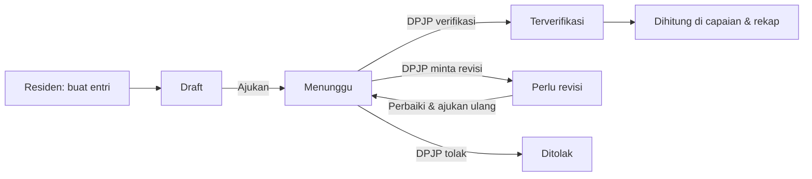

# Panduan Pengguna — Logbook Onkologi Ginekologi

Aplikasi **Logbook Onkologi Ginekologi** adalah logbook digital untuk PPDS
Subspesialis Onkologi Ginekologi (Prodi Subspesialis Obstetri & Ginekologi,
FK Universitas Sumatera Utara). Dokumen ini menjelaskan **tatacara
pendaftaran**, **alur pengisian**, dan **alur verifikasi** laporan di aplikasi.

> Ringkas: akun dibuat oleh KPS/Admin → residen mengisi entri (draft → ajukan)
> → pembimbing/DPJP memverifikasi → capaian kompetensi terhitung otomatis →
> rekap dapat dicetak/disimpan sebagai PDF.

---

## 1. Peran Pengguna

| Peran | Hak akses utama |
|---|---|
| **Residen** | Mengisi logbook, karya ilmiah, melihat capaian & mencetak rekap dirinya. Terikat satu program studi. |
| **Supervisor (DPJP)** | Memverifikasi entri & karya ilmiah residen yang ditujukan kepadanya. Lintas-prodi. |
| **Ketua Prodi** | Verifikasi, penilaian, rekap, kurikulum, audit, dan manajemen pengguna — **terbatas pada prodi yang dikelolanya** (boleh lebih dari satu prodi). |
| **SPS / Sekretaris Prodi** | Wewenang **identik dengan Ketua Prodi** (terbatas pada prodinya). |
| **Admin Prodi** | **READ-ONLY** — memantau seluruh data prodinya (dashboard, verifikasi, penilaian, rekap, kurikulum, audit, daftar pengguna) tanpa dapat mengubah apa pun. |
| **Administrator** | Akses penuh lintas seluruh program studi, termasuk pengaturan program & manajemen semua pengguna. |

Menu yang tampil di sisi kiri menyesuaikan peran masing-masing.

> **Komitmen anti-perundungan:** sekali setiap hari saat pertama membuka
> aplikasi, semua pengguna menerima pernyataan **Komitmen Anti-Perundungan** yang
> harus disetujui (tombol **“Saya Berkomitmen”**) sebelum melanjutkan.

---

## 2. Tatacara Pendaftaran

Aplikasi ini **tidak menyediakan pendaftaran mandiri**. Akun dibuat oleh
**KPS/Admin** untuk menjaga keabsahan data.

### 2.1 Pembuatan akun (oleh Ketua Prodi / SPS / Admin)
1. Masuk, buka menu **Manajemen User**.
2. Pada formulir **Tambah Pengguna**, isi:
   - **Nama lengkap**
   - **Peran** (lihat batas wewenang di bawah)
   - **Email** (dipakai untuk login)
   - **Password awal** (minimal 6 karakter; beritahukan ke pengguna)
   - **Prodi** — untuk Residen (dan KPS, oleh Administrator).
3. Simpan. Akun langsung aktif (email otomatis terkonfirmasi). Untuk peran
   **Residen**, data residen dibuat otomatis.

**Batas wewenang pembuatan & pengelolaan akun:**

| | Ketua Prodi / SPS | Administrator |
|---|---|---|
| Membuat akun | Residen (prodinya), DPJP | Semua peran (termasuk staf prodi & Administrator) |
| Mengubah peran | — (tidak bisa) | Semua pengguna |
| Menghapus akun | Hanya residen di prodinya | Semua pengguna |
| Daftar yang terlihat | Residen prodinya + DPJP (baca-saja) | Semua pengguna |
| Atur prodi staf prodi | — | Ya (1 staf boleh >1 prodi) |

Ketua Prodi & SPS **tidak** dapat membuat/mengubah/menghapus akun Administrator
atau staf prodi lain, maupun residen prodi lain. **Admin Prodi** bersifat
read-only — tidak dapat membuat/mengubah/menghapus pengguna sama sekali.
Administrator mengatur peran & prodi tiap Ketua Prodi / SPS / Admin Prodi.

### 2.2 Masuk (login)
1. Buka halaman aplikasi → layar **Masuk**.
2. Masukkan **Email** dan **Kata sandi**, lalu **Masuk**.
3. Berhasil masuk akan diarahkan ke **Dashboard**.
4. Pada kunjungan pertama setiap hari, tampil pernyataan **Komitmen
   Anti-Perundungan**; tekan **“Saya Berkomitmen”** untuk melanjutkan.

### 2.3 Lupa kata sandi
1. Pada halaman masuk, pilih **Lupa kata sandi**.
2. Masukkan email; tautan pengaturan ulang dikirim ke email.
3. Ikuti tautan untuk membuat kata sandi baru.

### 2.4 Melengkapi profil (khusus Residen — disarankan lebih dulu)
Buka menu **Profil** dan lengkapi:
- **Foto profil**
- **No. peserta**, **Angkatan**, **Tanggal mulai** pendidikan

Data ini muncul pada kop rekap/PDF, jadi sebaiknya diisi sebelum mencetak.

---

## 3. Alur Pengisian (Residen)

### 3.1 Jenis data yang diisi residen
- **Logbook** — kompetensi klinis, terdiri atas 3 jenis entri:
  - **Prosedur / Tindakan (Tabel 24)**
  - **Penatalaksanaan (Tabel 18)**
  - **Kasus / Spektrum penyakit**
- **Pengetahuan Saya** — daftar capaian OSCE/MCQ (dinilai oleh Ketua Prodi / SPS).
- **Karya Ilmiah** — sari pustaka, telaah jurnal, laporan kasus, tesis
  (bertahap), serta publikasi & presentasi.

### 3.2 Menambah entri logbook

> **Field wajib bertanda ✱ (merah)** harus terisi sebelum entri **diajukan**.
> Anda tetap bisa **Simpan draft** walau belum lengkap; tombol **Ajukan** akan
> menolak bila masih ada field wajib kosong dan menyebutkan field yang kurang.

1. Buka **Entri Baru**.
2. Pilih **Jenis Entri** (Prosedur / Penatalaksanaan / Kasus).
3. Isi data umum: **Tanggal**, **Setting**, **Rumah Sakit**, dan
   **DPJP penanggung jawab**. Pilihan DPJP mencakup **Supervisor, Ketua Prodi,
   dan SPS**.
4. Lengkapi data sesuai jenis:
   - **Prosedur:** prosedur, peran (operator utama/asisten), tingkat
     kemandirian, komplikasi (opsional).
   - **Penatalaksanaan:** komponen penatalaksanaan, jenis dokumentasi
     (MDT / Breaking bad news / Handover / lainnya untuk PK-09).
   - **Diagnosis (spektrum penyakit)** untuk semua jenis; stadium FIGO opsional.
5. Isi **Kode pasien / No. RM (tersamar)** & **Usia** (jaga kerahasiaan — jangan
   tulis identitas asli pasien).
6. **Catatan:** isi **ringkasan/resume medis pasien** (riwayat singkat, temuan,
   tindakan, hasil).
7. **Tautan bukti** (opsional): boleh menautkan **laporan operasi, foto/video
   tindakan, atau resume medis pasien** — pastikan **seluruh identitas pasien
   tersamar**, dan setel akses tautan ke "siapa saja yang memiliki link →
   Pelihat".
8. Simpan dengan salah satu tombol:
   - **Simpan draft** — tersimpan, belum dikirim ke DPJP (masih bisa diubah).
   - **Ajukan untuk verifikasi** — dikirim ke DPJP, status menjadi **Menunggu**.

> **Template entri cepat:** entri yang sering berulang bisa disimpan sebagai
> template lalu dipakai ulang agar pengisian lebih cepat.

### 3.3 Mengisi Karya Ilmiah
1. Buka menu **Karya Ilmiah**.
2. Pilih jenis: **Sari pustaka**, **Telaah jurnal**, **Laporan kasus**,
   **Tesis/penelitian**, **Publikasi**, atau **Presentasi**.
   - **Tesis** diisi **per tahap**: Proposal → Kaji etik → Pengumpulan data →
     Seminar hasil → Sidang.
   - **Publikasi** & **Presentasi** mencatat **tingkat (nasional/internasional)**,
     nama jurnal/event, DOI/tautan, dan bentuk (oral/poster untuk presentasi).
3. Isi judul, tanggal, pembimbing, dan tautan berkas; lalu **Simpan draft**
   atau **Ajukan untuk verifikasi**.

### 3.4 Menanggapi permintaan revisi
Bila DPJP meminta revisi, entri/karya berubah status **Perlu revisi** dan
muncul **catatan verifikator**. Perbaiki, lalu **ajukan ulang**.

---

## 4. Alur Verifikasi (DPJP / Ketua Prodi / SPS)

### 4.1 Memverifikasi entri & karya
1. Verifikator membuka menu **Verifikasi**. Halaman ini berisi dua bagian:
   - **Entri logbook menunggu**
   - **Karya ilmiah menunggu**
   (DPJP hanya melihat item yang ditujukan kepadanya. Ketua Prodi/SPS melihat
   item residen di prodi yang dikelolanya; Administrator melihat seluruh prodi.)
   Tiap kartu menampilkan **"Diajukan ke DPJP: …"** sehingga terlihat entri
   ditujukan ke verifikator siapa.
2. Periksa rincian dan **bukti** yang dilampirkan.
3. Pilih keputusan (boleh menambahkan **catatan**):
   - **Verifikasi** → status **Terverifikasi** (dihitung sebagai capaian).
   - **Minta revisi** → status **Perlu revisi** (dikembalikan ke residen).
   - **Tolak** → status **Ditolak**.

### 4.2 Notifikasi
- **Lonceng in-app (real-time):** memberi tahu DPJP/pembimbing setiap kali ada
  entri/karya baru ditujukan kepadanya, dan memberi tahu residen saat ada
  keputusan verifikasi. Badge angka pada menu **Verifikasi** menunjukkan jumlah
  yang menunggu.
- **Email ringkasan mingguan (Senin pagi):** tiap DPJP yang **punya antrian**
  menerima **satu email** berisi seluruh entri & karya yang menunggu
  verifikasinya pekan itu — bukan email per item. (WhatsApp tidak digunakan.)

### 4.3 Jejak audit
Setiap pembuatan, pengajuan, dan keputusan verifikasi tercatat di **Audit Log** —
mencatat siapa melakukan apa dan kapan. KPS melihat jejak prodi yang dikelolanya;
Administrator melihat seluruh prodi.

---

## 5. Status Laporan

| Status | Arti |
|---|---|
| **Draft** | Tersimpan oleh residen, belum diajukan. Masih bisa diubah/dihapus. |
| **Menunggu** (`diajukan`) | Sudah diajukan, menunggu keputusan DPJP. |
| **Terverifikasi** | Disetujui DPJP; **dihitung** sebagai capaian kompetensi. |
| **Perlu revisi** | Dikembalikan untuk diperbaiki; lihat catatan verifikator. |
| **Ditolak** | Tidak disetujui. |

> Hanya entri **Terverifikasi** yang dihitung pada progres capaian.

---

## 6. Penilaian Pengetahuan (Ketua Prodi / SPS / Admin)

1. Buka menu **Penilaian** — hanya **Ketua Prodi**, **SPS**, dan **Administrator**
   yang dapat memberi nilai (Admin Prodi hanya memantau).
2. Pilih residen dan butir pengetahuan yang dinilai (mis. WBA/OSCE/MCQ), lalu
   catat hasilnya.
3. Hasil penilaian muncul pada capaian **Pengetahuan** residen dan rekap.
4. **Nilai boleh diberikan berulang** — nilai **tertinggi** otomatis dipakai
   sebagai capaian yang tampil di dashboard residen.

---

## 7. Rekap & Pemantauan Program (KPS / Admin)

- **Rekap** — ringkasan capaian residen, beban verifikasi per DPJP, proyeksi
  kelulusan, dan rekap karya ilmiah. Data dapat **diekspor CSV**. KPS melihat
  prodi yang dikelolanya; Administrator melihat seluruh prodi.
- **Dashboard** menampilkan ringkasan capaian (residen) atau daftar residen &
  rekap agregat (staf).
- **Kurikulum** — KPS/Administrator dapat melihat & mengelola data kompetensi
  (prosedur, penatalaksanaan, pengetahuan, spektrum penyakit) sesuai cakupan
  prodinya.
- **Audit Log** — jejak seluruh aktivitas penting (sesuai cakupan prodi).
- **Laporan Platform** — ringkasan agregat lintas seluruh prodi, **khusus
  Administrator**.

---

## 8. Mencetak / Menyimpan PDF

1. Buka **Dashboard** (residen) atau **detail residen** (staf).
2. Gulir ke bagian bawah dokumen rekap.
3. Klik **Cetak / Simpan PDF**.
4. Pada dialog cetak, pilih printer atau **Save as PDF**.

> Saat mencetak, tema otomatis menjadi terang dan ukuran teks dinormalkan agar
> dokumen rapi. Tombol & navigasi tidak ikut tercetak.

---

## 9. Pengaturan Tampilan

- **Ukuran teks** — di menu **Profil → Tampilan**, gunakan **A− / A+** untuk
  memperkecil/memperbesar teks (tersimpan di perangkat). Memperkecil membantu
  menampilkan lebih banyak kolom tabel di layar kecil.
- **Mode gelap/terang** — tombol pada bilah atas.
- **Tabel di smartphone** — tabel lebar dapat **digeser ke samping**; tanda
  panah di tepi kanan menunjukkan masih ada kolom tersembunyi.

---

## 10. Tanya Jawab Singkat

**Saya tidak bisa mengajukan entri.**
Pastikan **Pembimbing/DPJP** dan **Rumah sakit** sudah diisi — keduanya wajib
saat mengajukan.

**Mengapa capaian saya belum bertambah?**
Hanya entri **Terverifikasi** yang dihitung. Entri Draft/Menunggu belum masuk
hitungan.

**Saya lupa kata sandi.**
Gunakan **Lupa kata sandi** di halaman masuk, atau minta KPS/Admin mengatur
ulang.

**Bisakah saya mendaftar sendiri?**
Tidak. Akun dibuat oleh KPS/Admin melalui **Manajemen User**.

**Bagaimana menjaga kerahasiaan pasien?**
Gunakan **kode pasien tersamar**; jangan menulis nama atau identitas pasien.
